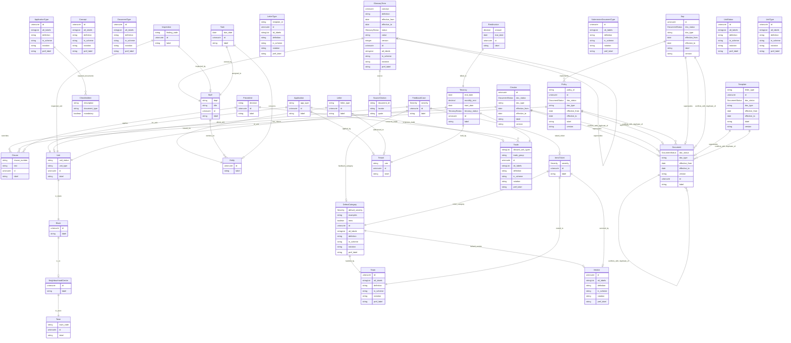

```mermaid
erDiagram
Application {
    string app_type  
    uriorcurie id  
    string label  
}
ApplicationType {
    uriorcurie id  
    stringList alt_labels  
    string definition  
    string in_scheme  
    string notation  
    string pref_label  
}
Block {
    uriorcurie id  
    string label  
}
ChecklistItem {
    string description  
    string document_type  
    boolean mandatory  
}
Circular {
    uriorcurie id  
    DocumentStatus doc_status  
    string doc_type  
    date effective_from  
    date effective_to  
    string label  
    string version  
}
Clause {
    string clause_number  
    string text  
    uriorcurie id  
    string label  
}
Concept {
    uriorcurie id  
    stringList alt_labels  
    string definition  
    string in_scheme  
    string notation  
    string pref_label  
}
DefectCategory {
    Severity default_severity  
    string examples  
    boolean iems  
    uriorcurie id  
    stringList alt_labels  
    string definition  
    string in_scheme  
    string notation  
    string pref_label  
}
Document {
    DocumentStatus doc_status  
    string doc_type  
    date effective_from  
    date effective_to  
    string version  
    uriorcurie id  
    string label  
}
DocumentType {
    uriorcurie id  
    stringList alt_labels  
    string definition  
    string in_scheme  
    string notation  
    string pref_label  
}
Entity {
    uriorcurie id  
    string label  
}
FeedbackCase {
    Severity severity  
    uriorcurie id  
    string label  
}
GlossaryTerm {
    uriorcurie concept  
    string definition  
    date effective_from  
    date effective_to  
    GlossaryStatus status  
    string value  
    integer version  
    uriorcurie id  
    stringList alt_labels  
    string in_scheme  
    string notation  
    string pref_label  
}
IemsTicket {
    Severity severity  
    uriorcurie id  
    string label  
}
Inspection {
    string finding_code  
    uriorcurie id  
    string label  
}
Letter {
    string letter_type  
    uriorcurie id  
    string label  
}
LetterType {
    string template_id  
    uriorcurie id  
    stringList alt_labels  
    string definition  
    string in_scheme  
    string notation  
    string pref_label  
}
NeighbourhoodCentre {
    uriorcurie id  
    string label  
}
Policy {
    string policy_id  
    uriorcurie id  
    DocumentStatus doc_status  
    string doc_type  
    date effective_from  
    date effective_to  
    string label  
    string version  
}
Precedent {
    string decision  
    uriorcurie id  
    string label  
}
RentInvoice {
    decimal amount  
    date due_date  
    uriorcurie id  
    string label  
}
Sop {
    uriorcurie id  
    DocumentStatus doc_status  
    string doc_type  
    date effective_from  
    date effective_to  
    string label  
    string version  
}
SourceCitation {
    string document_id  
    string locator  
    string quote  
}
Staff {
    string dept  
    string title  
    uriorcurie id  
    string label  
}
SubmissionDocumentType {
    uriorcurie id  
    stringList alt_labels  
    string definition  
    string in_scheme  
    string notation  
    string pref_label  
}
Task {
    date due_date  
    uriorcurie id  
    string label  
}
Team {
    uriorcurie id  
    stringList alt_labels  
    string definition  
    string in_scheme  
    string notation  
    string pref_label  
}
Template {
    string letter_type  
    uriorcurie id  
    DocumentStatus doc_status  
    string doc_type  
    date effective_from  
    date effective_to  
    string label  
    string version  
}
Tenancy {
    date end_date  
    decimal monthly_rent  
    date start_date  
    TenancyStatus tenancy_status  
    uriorcurie id  
    string label  
}
Tenant {
    string uen  
    uriorcurie id  
    string label  
}
Town {
    string town_code  
    uriorcurie id  
    string label  
}
Trade {
    stringList allowed_unit_types  
    string trade_group  
    uriorcurie id  
    stringList alt_labels  
    string definition  
    string in_scheme  
    string notation  
    string pref_label  
}
Unit {
    string unit_status  
    string unit_type  
    uriorcurie id  
    string label  
}
UnitStatus {
    uriorcurie id  
    stringList alt_labels  
    string definition  
    string in_scheme  
    string notation  
    string pref_label  
}
UnitType {
    uriorcurie id  
    stringList alt_labels  
    string definition  
    string in_scheme  
    string notation  
    string pref_label  
}
Vendor {
    uriorcurie id  
    stringList alt_labels  
    string definition  
    string in_scheme  
    string notation  
    string pref_label  
}

Application ||--|o Tenant : "applied_by"
Application ||--|o Trade : "proposes_trade"
Application ||--|| Unit : "for_unit"
ApplicationType ||--}o ChecklistItem : "required_documents"
Block ||--|o NeighbourhoodCentre : "in_nc"
Circular ||--|o Document : "supersedes"
Circular ||--}o Clause : "overrides"
Circular ||--}o Document : "conflicts_with, duplicate_of"
DefectCategory ||--|o Vendor : "default_vendor"
DefectCategory ||--|| Team : "handled_by"
Document ||--|o Document : "supersedes"
Document ||--}o Document : "conflicts_with, duplicate_of"
FeedbackCase ||--|o DefectCategory : "feedback_category"
FeedbackCase ||--|o IemsTicket : "raised_ticket"
FeedbackCase ||--|o Unit : "about_unit"
GlossaryTerm ||--|o GlossaryTerm : "supersedes"
GlossaryTerm ||--|| SourceCitation : "source"
GlossaryTerm ||--|| Staff : "owned_by"
IemsTicket ||--|o Vendor : "serviced_by"
IemsTicket ||--|| DefectCategory : "ticket_category"
IemsTicket ||--|| Team : "routed_to"
Inspection ||--|o Staff : "inspected_by"
Inspection ||--|| Unit : "inspected_unit"
Letter ||--|o Tenant : "addressed_to"
Letter ||--|| Entity : "issued_for"
NeighbourhoodCentre ||--|| Town : "in_town"
Policy ||--|o Document : "supersedes"
Policy ||--}o Clause : "has_clause"
Policy ||--}o Document : "conflicts_with, duplicate_of"
Precedent ||--}o Clause : "applies"
Precedent ||--}o Trade : "concerns_trade"
RentInvoice ||--|| Tenancy : "billed_to"
Sop ||--|o Document : "supersedes"
Sop ||--}o Document : "conflicts_with, duplicate_of"
Sop ||--}o Policy : "implements"
Staff ||--}o Entity : "worked_on"
Task ||--|o Entity : "concerns"
Task ||--|| Staff : "assigned_to"
Template ||--|o Document : "supersedes"
Template ||--}o Document : "conflicts_with, duplicate_of"
Tenancy ||--|| Tenant : "held_by"
Tenancy ||--|| Trade : "for_trade"
Tenancy ||--|| Unit : "of_unit"
Unit ||--|| Block : "in_block"

```

